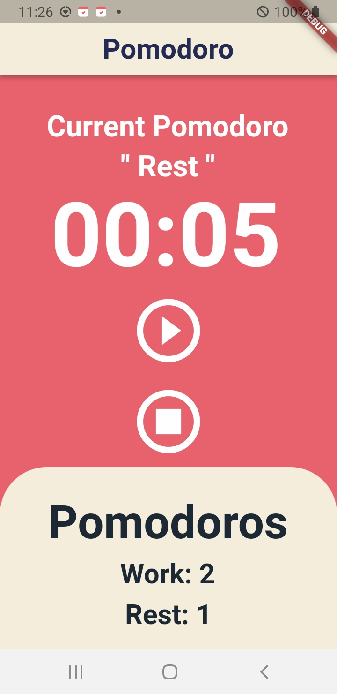
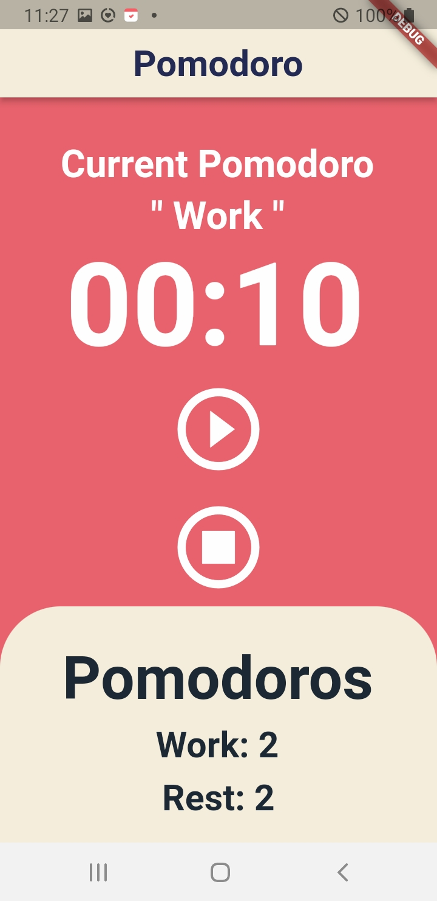

# Flutter Pomodoro App Clone

- **One of my personal digital nomad life projects (for practice).**
- **Project current status: [complete]**:ballot_box_with_check:
- **Tech**

  

    &emsp;
    
  

  

    &emsp;
    
  

- **Preview Screenshots**

  

    &emsp;
    
  
  
  &emsp;
  

    &emsp;
    
  

 
